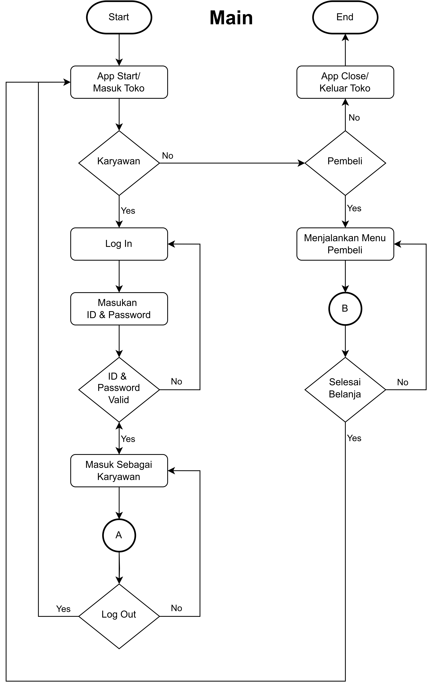

# tokokelontong

Purwadhika - Capstone Projects Modul 1

Deskripsi Proyek
Proyek ini adalah sebuah sistem manajemen toko sederhana yang memungkinkan pengguna untuk berbelanja dan karyawan untuk mengelola inventaris toko. Sistem ini terdiri dari tiga modul utama: main.py, karyawan.py, dan toko.py. Setiap modul memiliki fungsionalitas yang berbeda, mulai dari login karyawan, manajemen inventaris, hingga proses pembelian barang oleh pelanggan.

Struktur Proyek

1. main.py
   Fungsi Utama: Menampilkan menu utama yang memungkinkan pengguna untuk memilih antara masuk sebagai karyawan atau mulai berbelanja.
   

Fitur:

Masuk sebagai karyawan untuk mengelola inventaris dan melihat laporan penjualan.

Mulai berbelanja untuk memilih dan membeli barang dari toko.

Keluar dari aplikasi.

2. karyawan.py
   Fungsi Utama: Menyediakan antarmuka untuk karyawan mengelola inventaris toko, melihat daftar member, dan melihat laporan penjualan.
   

Fitur:

Login Karyawan: Verifikasi username dan password karyawan.

Manajemen Inventaris:

Lihat daftar item toko.

Tambah, hapus, dan edit item toko.

Tambah stok item.

Edit promo item.

Restore item yang terhapus.

Manajemen Member:

Lihat daftar member.

Tambah, hapus, dan restore member.

Laporan Penjualan: Melihat rekap penjualan dan total pendapatan.

3. toko.py
   Fungsi Utama: Menyediakan antarmuka untuk pelanggan berbelanja dan melakukan pembayaran.

Fitur:

Daftar Barang: Menampilkan daftar barang yang tersedia di toko.

Item Promo: Menampilkan item yang sedang dalam promo.

Keranjang Belanja: Menambahkan item ke keranjang belanja dan melihat isi keranjang.

Pembayaran: Proses pembayaran dengan atau tanpa diskon member.

Nota Transaksi: Menyimpan transaksi yang telah dilakukan.

Cara Menjalankan Proyek
Menu Utama:

Setelah aplikasi dijalankan, Anda akan melihat menu utama dengan pilihan:

Masuk sebagai karyawan.

Mulai berbelanja.

Keluar dari aplikasi.

Masuk Sebagai Karyawan:

Pilih opsi "Masuk Sebagai Karyawan" dan masukkan username dan password yang valid.

Setelah login, Anda dapat mengelola inventaris, melihat daftar member, dan melihat laporan penjualan.

Mulai Berbelanja:

Pilih opsi "Mulai Berbelanja" untuk melihat daftar barang yang tersedia.

Anda dapat menambahkan barang ke keranjang belanja dan melakukan pembayaran.

Contoh Penggunaan

1. Login Karyawan
   Masukkan username dan password yang valid.

Setelah login, Anda dapat mengelola inventaris toko, menambah atau menghapus item, dan melihat laporan penjualan.

2. Berbelanja
   Pilih item yang ingin dibeli dan masukkan jumlah yang diinginkan.

Tambahkan item ke keranjang belanja dan lanjutkan ke proses pembayaran.

Jika Anda adalah member, masukkan ID member untuk mendapatkan diskon.

3. Pembayaran
   Masukkan jumlah uang yang akan dibayarkan.

Sistem akan menghitung kembalian dan menampilkan nota transaksi.
